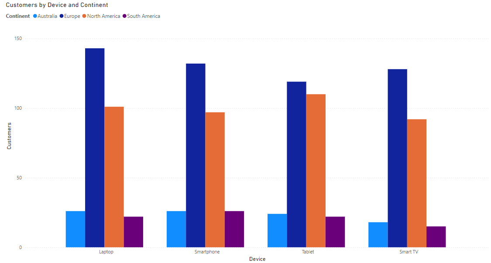
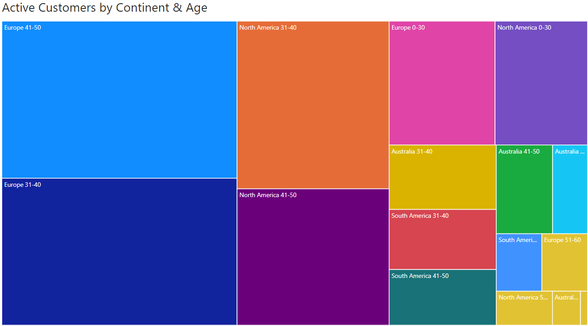
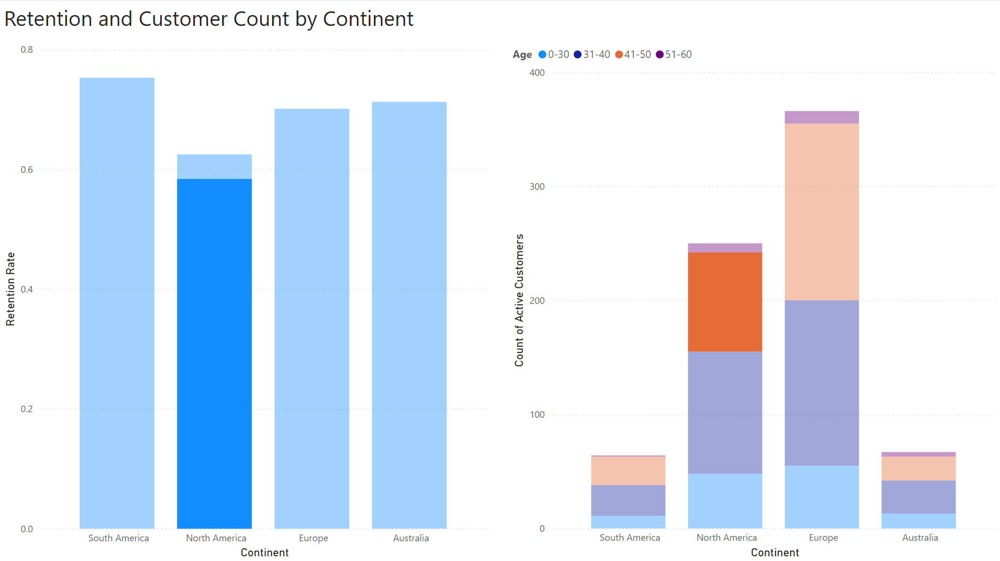

# Improving Customer Retention for Netflix

## Overview

This is a data analysis project (focussed on MySQL and Power BI) conducted by [Ayush Shrestha](https://www.linkedin.com/in/ayush-yoshi-shrestha/), as part of a team project for BUS AN 512 (Data Management and Visualization) for the University of Washington's Master of Science in Business Analytics program. Other team contributors include
[Hyewon Jeong](https://www.linkedin.com/in/jeonghyewon/),
[Aartdina van den Hoek](https://www.linkedin.com/in/aartdina/),
[Xin Hu](https://www.linkedin.com/in/xinhu-ashley/),
and [Bryant Tsai](https://www.linkedin.com/in/btsai1996/).

The project analyzed a synthetic dataset (originally retrieved from Kaggle [here](https://www.kaggle.com/datasets/arnavsmayan/netflix-userbase-dataset)) of Netflix customer records.

## Business Problem

As competition in the streaming market intensifies, Netflix must leverage its wealth of customer data to refine its retention strategies and maintain audience engagement. Without these efforts, certain customer segments may start disengaging from the platform, which in the worst case would lead to increased churn through unsubscribing. By utilizing data-driven strategies, Netflix can gain insights into retention trends across its customer base, identify high-risk segments prone to churn, and tailor its marketing efforts, content acquisition, and production strategies to re-engage and retain those viewers effectively.

## Dataset Overview

The dataset consists of approximately 2,500 synthetic records of Netflix customers, containing attributes such as:

- subscription plan
- last payment date
- country of residence
- age
- preferred device type

Since the data is synthetic, it is already very clean, requiring minimal preprocessing before analysis. This allows us to jump directly into deriving insights from the dataset.

## Pre-processing

For ease of data ingestion into MySQL Workbench, the original CSV file was converted into a SQL DDL script using an online tool. During the conversion, several key parameters were configured to ensure accuracy, including:

- defining the primary key
- enforcing data integrity constraints (such as non-null values for certain columns)
- adding a DROP TABLE statement at the beginning of the script for easy reusability

This approach streamlined the setup process and ensured the data was properly structured for analysis.

## EDA

Exploratory Data Analysis (EDA) was conducted using MySQL and visualized in Power BI to examine the distribution of customers across available factors, such as:

- geographic region
- subscription plan
- preferred device type

For example, the chart below illustrates that, across the four recorded device types, Europe represents the largest market by customer count. This is closely followed by North America.

The following visualization further supports this observation. It highlights that within these major markets, the majority of Netflix's customer base falls within the 31–50 age range.

Additionally, descriptive statistics, including ranges and averages, were calculated for various segments to assess data spread and central tendencies. This preliminary analysis provided a comprehensive overview of the dataset, positioning us to proceed with an in-depth analysis of customer retention rates.

## Analysis

Focusing on retention rates, we first assumed that a last payment date before December 2023 indicates an inactive account i.e., the customer has likely churned and unsubscribed. With this assumption, Common Table Expressions (CTEs) and CASE statements were utilized to group the data more effectively. This included:

- _Continent Mapping_: organizing individual countries into their respective continents
- _Age Bucketing_: segmenting customers into age buckets
- _Defining Active Status_: creating a binary "active" column to indicate whether a customer is currently active (1) or inactive (0)

From there we could compare the active customer count against the total, enabling the calculation of retention rates across various segments. Additionally, a secondary result set was generated to analyze the relationship between a customer's "active" status and their subscription tenure (length of time subscribed to Netflix). This would aid in uncovering insights into how customer loyalty, measured by years of subscription, impacts retention rates.

The results from these queries were exported to CSV files and uploaded into Power BI for visualization and further analysis. The Power BI workbook, available [here](analysis/netflix-data-viz.pbix), provides a comprehensive analysis of retention rates against customer tenure, age, and continent. It also highlights retention trends in Netflix’s two largest markets, Europe and North America, with a focus on age and preferred device type.

## Findings & Recommendations

Among the key insights from the analysis, one of the most noteworthy is that North American (NA) customers aged 41-50, who make up 35% of the NA market, exhibit a 5% lower retention rate compared to the rest of their cohort. In contrast, no similar trend is observed in the European market (the next most similar market in terms of size), indicating this is a unique phenomenon specific to NA. This insight is visually represented in the dashboard screenshot below, and is also available in the Power BI workbook for further review:

To address the retention gap in this cohort, Netflix should focus on targeted marketing efforts aimed at raising retention rates to at least the market average, which would yield an increase of 1.75% overall. Potential strategies include:

- _UX Enhancement for Families_: Optimizing the platform’s user experience for family viewing. Given that many customers in the 41-50 age bracket likely have young to adolescent children, Netflix could enhance features such as robust, intuitive parental controls and personalized content recommendations for family-friendly viewing. While these features are common on many platforms, Netflix could leverage its years of expertise in delivering an exceptional user experience to offer a more seamless, sophisticated interface, setting itself apart from competitors.

- _Must-Watch Lists_: Developing curated playlists of must-watch movies and shows that resonate with this generation. By tapping into Netflix’s extensive library, the platform could highlight movies and TV shows that North American customers in this age group grew up with and would enjoy revisiting. By evoking nostalgia, Netflix can strengthen engagement in a way that other competing platforms might struggle to replicate due to their relatively smaller content libraries.

By leveraging its vast data resources, Netflix can adopt a data-driven approach to identify key trends, tailor strategies to meet customer needs, and optimize its offerings. This approach will enhance customer retention and further solidify Netflix's position as a market leader in the entertainment streaming industry.
